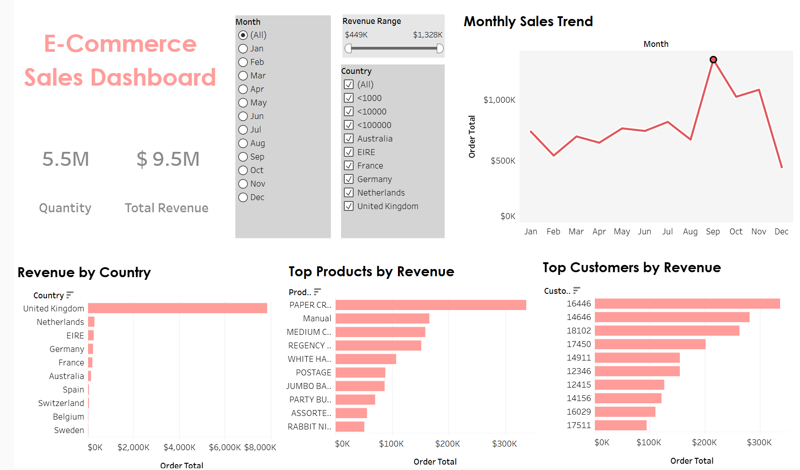
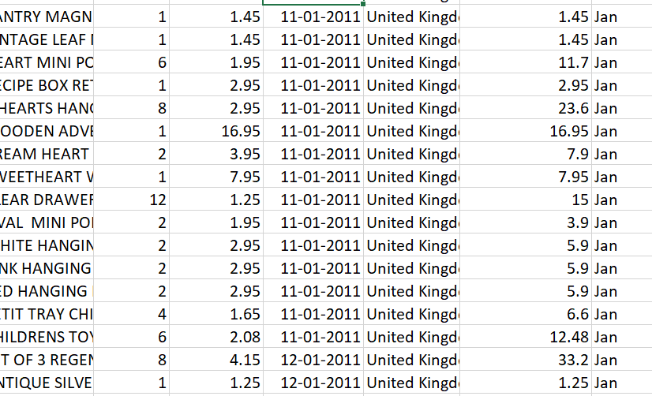
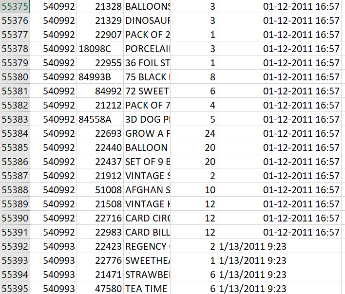

# 🛒 E-commerce Data Analysis

## 🎯 Objective  
To analyze e-commerce sales data and generate insights on customer behavior, product performance, and sales trends to support business decision-making.

---

## 🛠️ Tools Used  
- Excel (Data Cleaning, Pivot Tables, Formulas)  
- SQL (Data Queries, Aggregations, Customer Analysis)  
- Tableau (Dashboard and Visualization)  

---

## 📂 Dataset  
- E-commerce dataset (public dataset)  

---

## 🔍 Analysis Performed  
- Cleaned and prepared raw data using Excel  
- Performed sales and customer analysis using SQL queries  
- Identified top-selling products and categories  
- Analyzed customer purchase behavior and trends  
- Created visual dashboards in Tableau for better insights  

---

## 📈 Key Insights  

- Top-selling products contributed significantly to overall revenue  
- Customer purchase patterns showed repeat buying behavior  
- Sales trends indicated monthly and seasonal variations  
- Certain products and categories underperformed and need improvement  

---

## 📊 Dashboard  
  

---

## 💡 Business Impact  

- Helps identify high-performing products and categories  
- Supports customer targeting and marketing strategies  
- Enables better inventory and sales planning  

---

## 📌 Skills Demonstrated  
- Data Cleaning  
- Data Analysis  
- SQL Querying  
- Data Visualization  
- Business Insight Generation  

## 📸 Data Cleaning Preview
--clean_data:

--raw_data:

